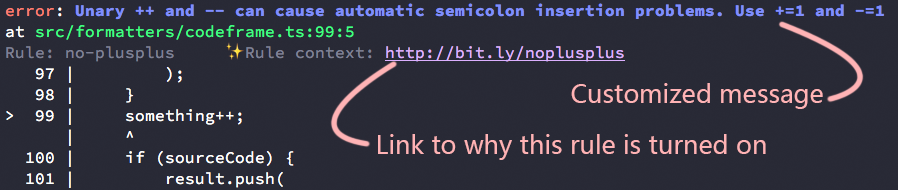
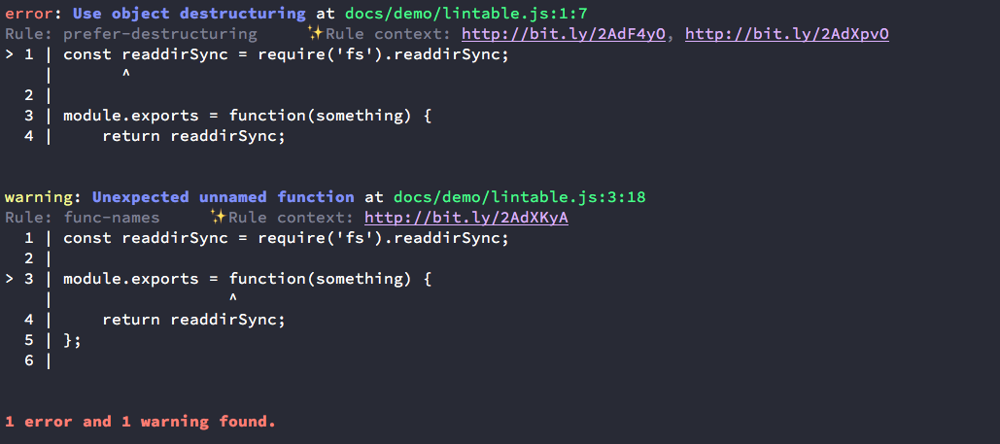
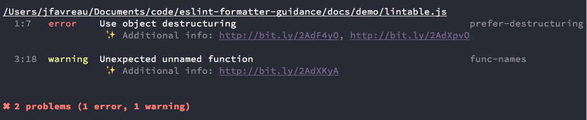
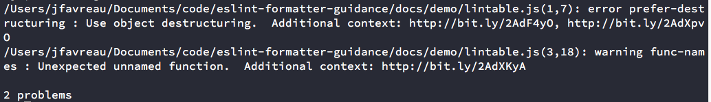

# Compassionate Linting (`eslint-formatter-compassion`)

[](https://www.npmjs.com/package/eslint-formatter-compassion)
[](https://github.com/betaorbust/eslint-formatter-compassion/blob/master/package.json)
[](https://travis-ci.org/betaorbust/eslint-formatter-compassion)
[](https://david-dm.org/betaorbust/eslint-formatter-compassion)
[](https://david-dm.org/betaorbust/eslint-formatter-compassion?type=dev)

A tool for customizing messages and adding context links in ESLint. Let your contributors know _why_
a rule is turned on, and what they can do to fix their code.



## Why?

> _Compassion is a more active form of empathy._  
> _– April Wensel_

ESLint is a fantastic tool that lets us write better, more maintainable code. Unfortunately, when
contributors get feedback from a linter, it usually comes across about as friendly as

```
You did something wrong. Here's a token to Google around for.
```

That's frustrating! Especially when your contributor doesn't know exactly what the rule is trying to
enforce or, more importantly, _**why**_ the project has it enabled.

**We can do better, by sharing insight into our project's values and providing additional context
right at the moment linting errors appear. This fosters a more aligned, less contentious development
environment.**

`eslint-formatter-compassion` helps provide this alignment by letting you add contextual links to
your _**own style guide**_ (or any of the [guides](#guides) provided by this package) and modify
existing lint error messages to fit your organization's needs. Leave linting code up to ESLint, but
when it comes time to communicate with human engineers, grab the reins and set some better context.


## Usage

### Quickstart

`eslint-formatter-compassion` provides several out-of-the-box ESLint formatters that use all the
general guide data available. Getting started is as easy as telling ESLint which formatter to use.

```bash
# Assuming you already have eslint running in your project.
# If not, see https://eslint.org/docs/user-guide/getting-started

# Add eslint-formatter-compassion as a dependency.
# If you're using NPM: npm install eslint-formatter-compassion --save-dev
yarn add -D eslint-formatter-compassion

# Lint using one of the pre-baked all-guides-enabled formatters
# The -f (or --format) flag lets you select a different formatter.
eslint ./ -f './node_modules/eslint-formatter-compassion/formatters/pre-baked-with-all-guides/stylish'
```

### Project Components

This package provides three major component types:

-   [Guides](#guides)
    -   Guides optionally provide better messages or contextual links for linting failures.
    -   You can make your own to add your own context.
-   [Formatters](#formatters)
    -   Process the output of ESLint into something human readable a guide, to help augment their
        output.
-   Prebaked All-in-one ESLint formatters
    -   With all our supported guides. Just pick one of the pre-built, ESLint-compatible formatters
        from `eslint-formatter-compassion/pre-baked-with-all-guides/<formatter type>`

You can roll your own formatter using `eslint-formatter-compassion` as a base, or use one of the
pre-built formatters of your choice.

### Guides

Guides are the data source for augmenting eslint output. They can provide replacement messages as
well as multiple context links. A sample guide for modifying ESLint's built-in `semi` rule would
look something like this:

```js
module.exports = {
    name: 'myguide', // Each guide is named for debugability
    schema: 1, // Schema to automatically detect future breaking changes
    rules: {
        // A rules object
        semi: {
            // Keys by ruleId
            // Optional message to override the default one provided by `semi`
            message: 'Automatic semicolon insertion is hard to grok, so we use semicolons in JS.',
            // Optional array of links to external context. In this case, a blog post.
            context: ['http://bit.ly/semiplease']
        }
    }
};
```

If you'd like to use your own guide content, please see the section below on rolling your own
formatter.

### Compassionate Formatters

Compassionate Formatters are very similar to
[ESLint's formatters](https://eslint.org/docs/user-guide/formatters/), with the exception that they
take in an array of [Guides](#guides), and augment their output with those Guides' data. Because
they take an additional agument, Compassionate Formatters not compatible with ESLint right out of
the box. If you'd like an easy start, see the Quick-Start section, which uses the pre-built,
ESLint-compatible versions of these formatters. If you'd like to make your own or use custom guide
information, see the section below on making your own custom formatter.

### Pre-built Formatters

There are several pre-built format styles (based off of popular eslint-provided formatters) which
can be found in `eslint-formatter-compassion/formatters/pre-baked-with-all-guides/<formatName>` and
are immediately usable with ESLint.

Currently, we have:

-   `codeframe` Providing the maximum context for a linting error.
    -   Based on ESLint's
        [codeframe formatter](https://eslint.org/docs/user-guide/formatters/#codeframe).
    -   `eslint-formatter-compassion/formatters/pre-baked-with-all-guides/codeframe`
    -   
-   `stylish` Providing a more compact view.
    -   Based on ESLint's
        [stylish formatter](https://eslint.org/docs/user-guide/formatters/#stylish).
    -   `eslint-formatter-compassion/formatters/pre-baked-with-all-guides/stylish`
    -   
-   `visualstudio` For use in IDE tooltips.
    -   Based on ESLint's
        [visualstudio formatter](https://eslint.org/docs/user-guide/formatters/#visualstudio).
    -   `eslint-formatter-compassion/formatters/pre-baked-with-all-guides/visualstudio`
    -   

Each pre-built solution includes every available [guide](#guide).

#### Use:

```sh
## Pass the path to your pre-baked formatter of choice using the -f or --format flag
eslint ./ -f './node_modules/eslint-formatter-compassion/formatters/pre-baked-with-all-guides/stylish'
```

## Customizing Formatters

If you'd like to add your own context links or message customization, you can add compose an
eslint-compatible formatter using the libraries and data provided by `eslint-formatter-compassion`.

```js
// Load up all the guides we want to use
const airbnb = require('eslint-formatter-compassion/guides/airbnb');
const eslint = require('eslint-formatter-compassion/guides/eslint');
const importGuide = require('eslint-formatter-compassion/guides/import');
const jsxA11y = require('eslint-formatter-compassion/guides/jsx-a11y');
const react = require('eslint-formatter-compassion/guides/react');

// Import the formatter we want to use for output
const formatter = require('eslint-formatter-compassion/formatters/codeframe');

// Here are the custom rules.
// In this case we'll override eslint's `semi` rule to have a better error
// message as well as providing a link for context when the error is hit.
const myGuide = {
    name: 'myguide',
    schema: 1,
    rules: {
        semi: {
            message:
                'Automatic semicolon insertion is hard to grok, so we choose to use semicolons in JS.',
            context: ['http://bit.ly/semiplease']
        }
    }
};

// We now pick the guides we want to include.
// Order is important. It's usually best to start with 'eslint' and build
// up from there. The order of precedence is right to left.
const guides = [eslint, importGuide, jsxA11y, react, airbnb, myGuide];

// finally, we export a single function, taking in the results from ESLint,
// and returning the output of calling our formatter with our results, and
// our guides.
module.exports = eslintResults => formatter(eslintResults, guides);
```

With the above file saved as `./my-formatter.js` in your project, you can run eslint with your
custom compassionate formatter like this:

```sh
eslint ./ -f './my-formatter.js'
```
